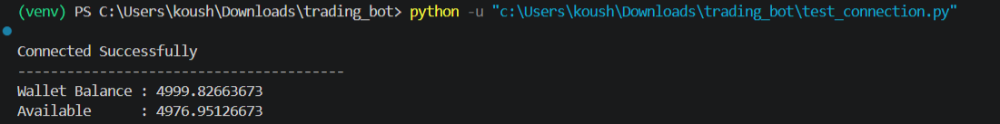
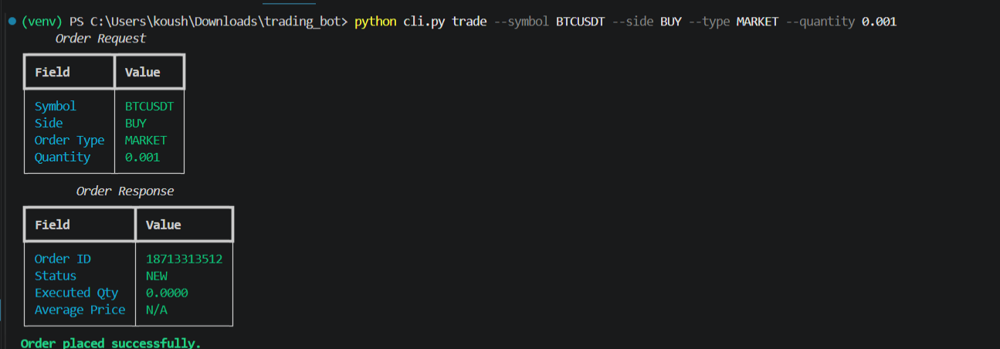
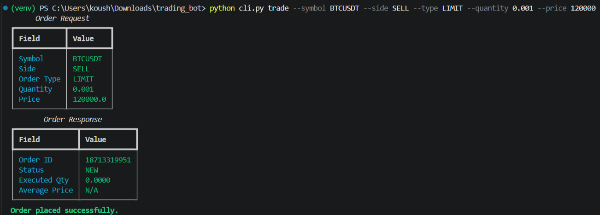
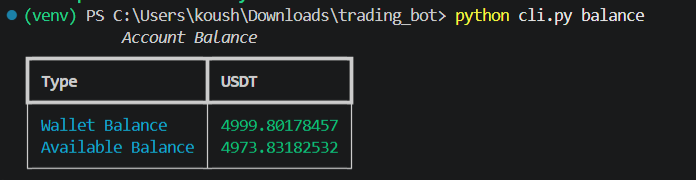
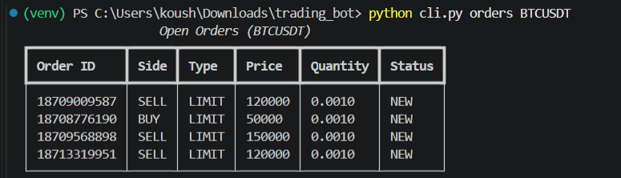

# Binance Futures Trading Bot

A simple command-line trading bot built in Python for the Binance USDT-M Futures Testnet.

The application allows users to place **BUY** and **SELL** orders using both **MARKET** and **LIMIT** order types through the Binance Futures Testnet API. It also provides account balance, open orders, logging, and proper error handling.

This project was developed as part of a Python Developer technical assessment with a focus on clean project structure, reusable code, and API integration.

---

## Features

- Place MARKET orders
- Place LIMIT orders
- Supports BUY and SELL
- Account balance lookup
- View open orders
- Cancel open orders
- Input validation
- Logging of API requests and responses
- Exception handling
- Modular code structure
- Command-line interface using Typer

---

## Project Structure

```
binance-futures-trading-bot/
│
├── bot/
│   ├── __init__.py
│   ├── client.py
│   ├── config.py
│   ├── logging_config.py
│   ├── orders.py
│   └── validators.py
│
├── logs/
│   ├── market_order.log
│   ├── limit_order.log
│   └── trading_bot.log
│
├── screenshots/
│   ├── connection.png
│   ├── market_order.png
│   ├── limit_order.png
│   ├── balance.png
│   └── open_orders.png
│
├── tests/
│   └── test_validators.py
│
├── .env.example
├── .gitignore
├── cli.py
├── LICENSE
├── README.md
├── requirements.txt
└── test_connection.py
```

---

## Technologies Used

- Python 3
- python-binance
- Typer
- Rich
- python-dotenv

---

## Installation

Clone the repository

```bash
git clone https://github.com/<your-github-username>/binance-futures-trading-bot.git

cd binance-futures-trading-bot
```

Create a virtual environment

Windows

```bash
py -m venv venv
```

Activate

```bash
venv\Scripts\activate
```

Install dependencies

```bash
pip install -r requirements.txt
```

---

## Configuration

Create a `.env` file in the project root.

Example:

```env
API_KEY=YOUR_API_KEY
API_SECRET=YOUR_API_SECRET
BASE_URL=https://testnet.binancefuture.com
```

Generate the API Key and Secret from the Binance Futures Testnet before running the application.

---

# Usage

## Check Connection

```bash
python test_connection.py
```

---

## Place a MARKET Order

```bash
python cli.py trade --symbol BTCUSDT --side BUY --type MARKET --quantity 0.001
```

---

## Place a LIMIT Order

```bash
python cli.py trade --symbol BTCUSDT --side SELL --type LIMIT --quantity 0.001 --price 120000
```

---

## View Account Balance

```bash
python cli.py balance
```

---

## View Open Orders

```bash
python cli.py orders BTCUSDT
```

---

## Cancel an Order

```bash
python cli.py cancel BTCUSDT <ORDER_ID>
```

---

# Screenshots

## Connection Test

Shows successful connection to the Binance Futures Testnet account.



---

## MARKET Order

Example of placing a BUY MARKET order.



---

## LIMIT Order

Example of placing a SELL LIMIT order.



---

## Account Balance

Displays wallet balance and available balance.



---

## Open Orders

Lists all currently open orders for the selected trading pair.



---

# Logging

Every API request and response is automatically logged.

Example log:

```
2026-07-03 17:45:12 | INFO | Order Request | Symbol=BTCUSDT | Side=BUY | Type=MARKET | Quantity=0.001

2026-07-03 17:45:13 | INFO | Order Response | OrderID=1871331951 | Status=NEW
```

Log files are stored inside the `logs/` directory.

---

# Error Handling

The application handles common errors such as:

- Invalid trading symbol
- Invalid order type
- Invalid order side
- Missing LIMIT price
- Invalid quantity
- Binance API exceptions
- Network-related errors
- Unexpected runtime exceptions

---

# Validation

Before placing an order, the application validates:

- Trading symbol
- BUY / SELL side
- MARKET / LIMIT order type
- Quantity
- Price (required for LIMIT orders)

This prevents invalid requests from being sent to the Binance API.

---

# Assumptions

- The project uses the Binance USDT-M Futures Testnet.
- Valid Testnet API credentials are required.
- LIMIT orders use Good Till Cancelled (GTC).
- Average execution price may not be immediately available after placing a new order.

---

# Future Improvements

Some features that could be added in the future include:

- Stop-Limit orders
- Take Profit / Stop Loss orders
- Position management
- Trade history
- Docker support
- Unit tests for API layer
- Interactive terminal dashboard
- Configuration file support

---

# License

This project is licensed under the MIT License.

---

# Author

**Koushik Amarendra**

B.Tech – Computer Science & Engineering (Cyber Security)

GitHub: https://github.com/koushik140106
